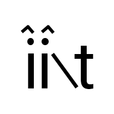

<h1 align="center">
   
  
   
  <b>iitapp</b>
   
  
  
  
</h1>

### Information
The iitapp allows students to check their schedule and assignments without the confusing nature of university websites. This app was made from the P33 Project for CS100 semester at IIT.

**NOTE:** The data in this repo is for testing. No functionality for retreiving any current data from IIT or blackboard.

### Features
- Home page shows the closest to due assignments aswell as an indicator of how many more assignments there are.
- Schedule consists of each day having a schedule, ordered by the time for each class. Each class also shows the location of the class.
- Assignments shows all assignments, the due dates, and which class that assignment was assigned from. The assignments are ordered according to what assignments are closer to due.
- Search lets users tap on which resource they would like to view from IIT, which will open in browser. A proper search function helps students easily find what they need.

### Screenshots
<h1 align="center">
  
  
  
  
</h1>

### Build
To build the app, you must have flutter installed to in order to build the app from this repo.
Please follow [this documentation](https://docs.flutter.dev/deployment/android) provided by Flutter. 
